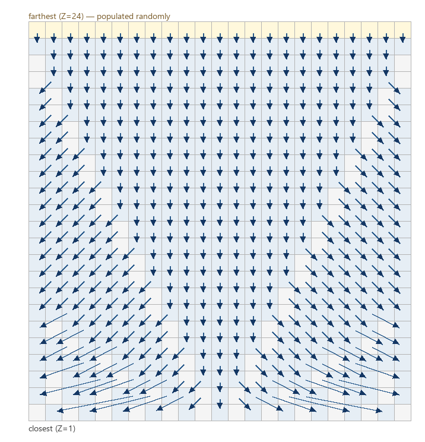

# Deathchase for the VIC-20

A port of the classic Spectrum 3d forest chase game for the VIC-20 with 8K RAM expansion.

It uses a raster split to change the background from sky to ground colour, because the VIC doesn't have per cell background colour. It also uses a lookup table to advance the trees and steer, which basically looks ahead in the tree map for a tree to pull forward and outward.


This is faster than the two or three pass Spectrum approach, and easier to make perspective correct. The screen is 23x22, very close to the VIC default 22x23, but with a line right down the middle so that it looks symmetrical. It's quite a simple game, and there's about 2k free should someone want to tweak some things or add features.

## Running

Load `chase.prg` on a VIC-20 with 8K expansion (PAL). In VICE:

```text
xvic -pal -memory 8k +basicload -autostart chase.prg
```

Or run `make.bat` if you have ACME and VICE set up locally.